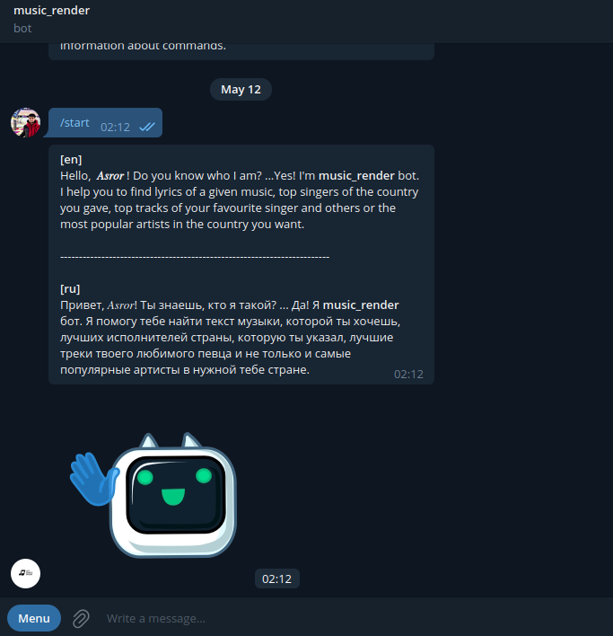
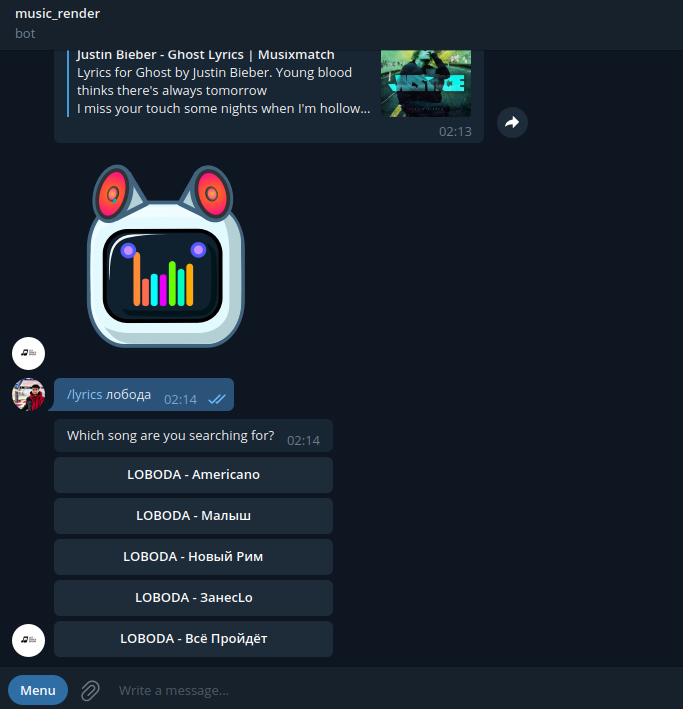
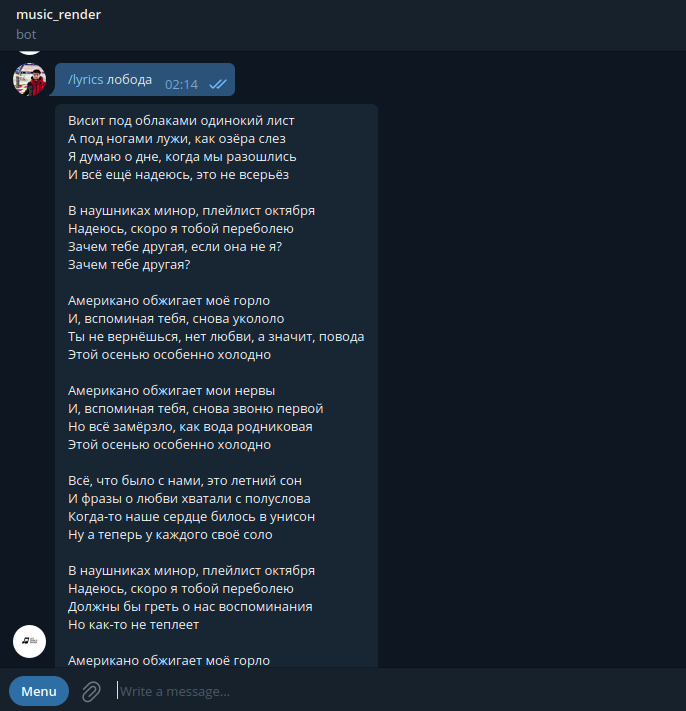

Music Render Bot
======

### Bot Info

[*Bot*](https://t.me/review_lyr_bot) works with two websites: [musixmatch.com](https://www.musixmatch.com/) and [azlyrics.com](https://www.azlyrics.com/). 
It gets statistics and information from [musixmatch.com](https://www.musixmatch.com/) using its API methods, and it 
parses [musixmatch.com](https://www.musixmatch.com/) to get lyrics of a given music. It also can provide the information
in some languages, except the music lyrics. It provides music lyrics in original. 
Type /help for information about commands.
About: This bot is for showing music lyrics, top charts of a given country and top tracks of a given singer.

This bot has these commands:
###    
    /start - Greetings to user
###
    /help - Shows you commands syntax, description and examples
###
    /set_lang <new_lang> - Sets a new language with which bot will work further.
###
    /tracks <given_singer> - Shows top tracks of a given singer.
###
    /charts <country_code> - Shows top tracks and their authors in a given country.
###
    /chart_artists <country_code> - Shows top singers in a given country.
###
    /lyrics <name_of_song> - Shows lyrics of a given song

## Demonstration

## RUN

### First clone the repository
    git clone https://github.com/alliseeisgold/review_2.git

### Run the Bot
    ./run.sh